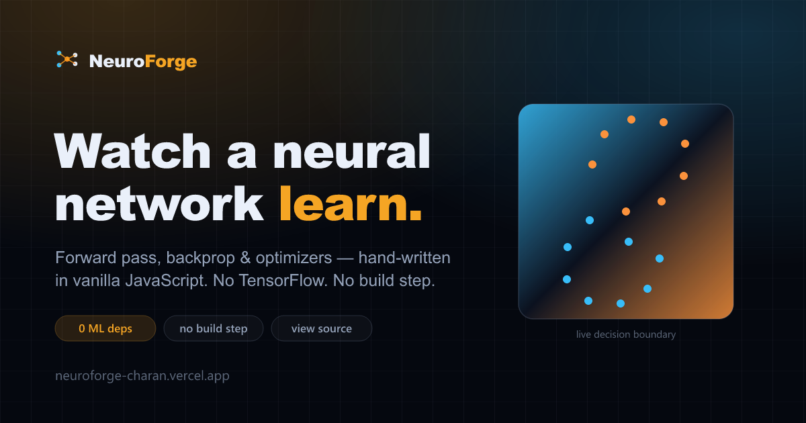

<div align="center">

# 🔥 NeuroForge

### Watch a neural network learn — and read the code that makes it.

**An interactive neural-network playground where the network is trained by a backpropagation engine written from scratch in vanilla JavaScript. No TensorFlow, no autograd, no dependencies.**

[**▶ Live demo**](https://neuroforge-charan.vercel.app/) · [The project](https://neuroforge-charan.vercel.app/about-project) · [About the author](https://neuroforge-charan.vercel.app/about)



</div>

> Build a network by hand, drop it on a dataset, hit **Train**, and watch it learn in real time: the decision boundary bends itself around the data, the connection weights thicken and fade as the optimizer works, and the loss/accuracy curves tick down live. The whole thing runs client-side in a single page — **view source, and the math is right there.**

> **📸 Screenshot / GIF:** Drop a short screen recording of the spiral being solved here — it sells the project in three seconds. See [DEPLOYMENT.md](DEPLOYMENT.md) for the checklist.

---

## Why this exists

Most "neural network demos" are a thin UI over a library that does all the real work. NeuroForge is the opposite: **the learning algorithm _is_ the project.** The forward pass, the gradients, the optimizers, the weight initialization — all of it is hand-written and readable in [`src/nn.js`](src/nn.js). The visualizer is wrapped around a real engine, not a toy.

If you want to understand backpropagation, reading ~250 lines of commented JavaScript that demonstrably trains a spiral classifier beats another diagram.

## ✨ Features

- **Five datasets** — spiral, circle, XOR, two gaussians, and interleaving moons, with adjustable noise, sample count, and train/test split.
- **Build the network live** — add/remove hidden layers, change neuron counts, switch activation (tanh / ReLU / sigmoid). The parameter count updates as you go.
- **Feature engineering** — toggle inputs `X₁, X₂, X₁², X₂², X₁X₂, sin X₁, sin X₂`. Solve the circle with *no hidden layers* once you add the squared terms — a logistic-regression lesson in one click.
- **Full optimizer control** — optimizer (SGD / Momentum / Adam), learning rate, batch size, and L2 regularization, all applied live.
- **Live decision boundary** — a diverging heatmap of the network's output across the whole plane, recomputed as it learns.
- **Live weight graph** — every connection coloured by sign (amber +, cyan −) and weighted by magnitude, so you literally see the network reorganize itself.
- **Presets** — one-click configurations (e.g. *"Solve the spiral"*) that load a known-good setup and start training.
- **Export** the trained model weights to JSON. Keyboard shortcuts (`space` train, `S` step, `R` reset).

## 🧠 The engine, briefly

For a single sigmoid-output binary classifier with binary cross-entropy loss, the output-layer gradient collapses to the clean form `dL/dz = (p − y)`. From there the deltas propagate backward through each layer:

```
δ_out = p − y
δ_l   = (Wᵀ_{l+1} · δ_{l+1}) ⊙ act'(z_l)
∂L/∂W_l = δ_l · aᵀ_{l-1}
```

Gradients are averaged over a mini-batch, L2 weight decay is added, and the chosen optimizer applies the update. Weights are initialized with He (ReLU) or Xavier (tanh/sigmoid) scaling from a seeded RNG, so any run is reproducible.

### Correctness

The gradients aren't taken on faith. A **numerical gradient check** (central differences vs. the analytic backprop) agrees to a maximum relative error of **~2e-10** — machine precision. The engine trains XOR, the circle, moons, and the two-spiral problem to ~100% train accuracy. See [`PROJECT_DEEP_DIVE.md`](PROJECT_DEEP_DIVE.md) for the full story.

## 🛠 Tech stack

| Layer | Choice | Why |
|---|---|---|
| Language | Vanilla JS (ES2015+) | The point is to read the algorithm, not a build config. |
| Rendering | HTML5 Canvas | Pixel-level control for thousands of draws a frame. |
| Styling | CSS custom properties | One hand-written design system, no UI kit. |
| Randomness | `mulberry32` seeded RNG | Reproducible runs — a bug today is the same bug tomorrow. |
| Hosting | Vercel (static) | Push to deploy, global edge, clean URLs. |
| Dependencies | **None** | Open `index.html` and it runs. |

## 📁 Project structure

```
neuroforge/
├── index.html            # the app shell + layout
├── about.html            # About the author
├── about-project.html    # About the project (the why, timeline, decisions)
├── styles.css            # the instrument's design system
├── pages.css             # design system for the content pages
├── og.svg / og.png       # social share image
└── src/
    ├── nn.js             # the neural network: forward, backprop, optimizers  ← the core
    ├── datasets.js       # dataset generators + feature engineering
    ├── boundary.js       # decision-boundary heatmap renderer
    ├── network-viz.js    # live weight/architecture graph
    ├── charts.js         # loss & accuracy line charts
    └── app.js            # state, controls, and the training loop
```

The modules are plain `<script>`s sharing a small `NF` namespace, so the whole app runs by **opening `index.html` directly** — no build step, no `node_modules`, nothing to install.

## ▶ Run it locally

```bash
# simplest: just open the file
start index.html            # Windows  (or: open index.html on macOS, xdg-open on Linux)

# or serve it (any static server works)
python -m http.server 8000
# then visit http://localhost:8000
```

There is no install step and no build step. That's the point.

## 🚀 Deploy

It's a static site, so any host works. Full Vercel instructions and a manual-steps checklist live in [`DEPLOYMENT.md`](DEPLOYMENT.md).

## 📚 More docs

- [`PROJECT_DEEP_DIVE.md`](PROJECT_DEEP_DIVE.md) — architecture, data flow, and how the hard parts actually work.
- [`INTERVIEW_PREP.md`](INTERVIEW_PREP.md) — walkthroughs, STAR stories, and likely Q&A.
- [`DEPLOYMENT.md`](DEPLOYMENT.md) — ship to Vercel + the manual checklist.
- [`CHANGELOG.md`](CHANGELOG.md) — what shipped, when.

---

## 👋 About the developer

**Chanda Charan Reddy** (Charan) — AI &amp; Automation Engineer, Bangalore.

I ship production LLM systems — from a Springer-published model that reads chest X-rays to document pipelines that run themselves. Before all that, I wrote real-time control code for jet engines at DRDO, where a millisecond of lag isn't a bug — it's a flameout. NeuroForge is what happens when I get tired of hand-wavy explanations and build the real thing instead.

This is one project. There are 18 more (and a few jet engines) over at **[charanreddy.dev](https://www.charanreddy.dev)**.

- 🌐 Portfolio — [charanreddy.dev](https://www.charanreddy.dev)
- 💼 LinkedIn — [/in/chandacharanreddy](https://www.linkedin.com/in/chandacharanreddy/)
- 🐙 GitHub — [@charanreddy-27](https://github.com/charanreddy-27)
- 📅 Book a call — [cal.com/charanreddy-27/30min](https://cal.com/charanreddy-27/30min)
- 🔬 ORCID — [0009-0003-2414-6717](https://orcid.org/0009-0003-2414-6717)

> **Want to build something — or break something interesting? Let's talk.**

## 📄 License

MIT — see [LICENSE](LICENSE).
